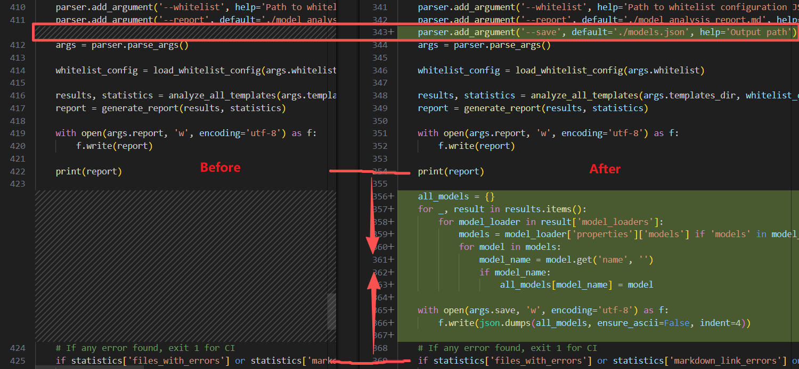

## Requirements
- install Ubuntu & Git & Docker
- install UV tool for Python
- install NVIDIA Container Toolkit
- **network proxy configuration**

## Initialize the project
clone this repository to local, and rebuild the python virtual environment.
```bash
git clone https://github.com/seanwen86/comfyui-docker.git
cd comfyui-docker
uv sync
source .venv/bin/activate
```

## Build Docker Image
1. clone this repository, and rebuild python virtual environment.
```bash
git clone https://github.com/seanwen86/comfyui-docker.git
cd comfyui-docker
uv sync
source .venv/bin/activate
```
2. download plugins
```bash
uv run plugins/clone_or_update_plugins.py
```
3. build docker image, comfyui with tag `comfyui:nightly`
```bash
docker build -t seanwen86/comfyui:nightly .
```
4. download models, **kinda huge**
```bash
uv run models/download_models.py
```
5. run ComfyUI container
```bash
docker run -d --gpus all -p 8188:8188 -v $(pwd)/models/models:/workspace/ComfyUI/models seanwen86/comfyui:nightly
```
6. visit comfyui via web browser, `127.0.0.1:8188`


## Update to latest ComfyUI release (Development)
1. clone this repository to local, and rebuild the python virtual environment.
```bash
git clone https://github.com/seanwen86/comfyui-docker.git
cd comfyui-docker
uv sync
source .venv/bin/activate
```
2. download latest release `ComfyUI-0.12.3.tar.gz` source code(tar.gz) of ComfyUI from website `https://github.com/Comfy-Org/ComfyUI/releases`, put it into folder `ComfyUI` . or using cmd like below to download, take `ComfyUI-0.12.3` for example.
```bash
curl -Lo ComfyUI/ComfyUI-0.12.3.tar.gz https://github.com/Comfy-Org/ComfyUI/archive/refs/tags/v0.12.3.tar.gz
```
3. uncompress `ComfyUI-0.12.3.tar.gz`，`comfyui-workflow-templates==0.8.31` can be found in `requirements.txt`. 
```bash
tar -xzvf ComfyUI/ComfyUI-0.12.3.tar.gz -C ComfyUI/
cat ComfyUI/ComfyUI-0.12.3/requirements.txt | grep workflow-templates
```
4. download `workflow_templates-0.8.31.tar.gz` source code(tar.gz) from website `https://github.com/Comfy-Org/workflow_templates/releases`, put it into folder `models`, or using cmd like below to download. Note that the specific version `v0.8.31`.
```bash
curl -Lo models/workflow_templates-0.8.31.tar.gz https://github.com/Comfy-Org/workflow_templates/archive/refs/tags/v0.8.31.tar.gz
```
5. uncompress `workflow_templates-0.8.31.tar.gz` to folder `models/workflow_templates-0.8.31`.
```bash
tar -xzvf models/workflow_templates-0.8.31.tar.gz -C models/
```
6. edit `models/workflow_templates-0.8.31/scripts/analyze_models.py`, and make following two changes.



```python
# python code for the first change
parser.add_argument('--save', default='./models.json', help='Output path')
```
```python
# python code for the second change
all_models = {}
for _, result in results.items():
    for model_loader in result['model_loaders']:
        models = model_loader['properties']['models'] if 'models' in model_loader['properties'] else []
        for model in models:
            model_name = model.get('name', '')
            if model_name:
                all_models[model_name] = model
    
```

7. enter folder `models/workflow_templates-0.8.31` in which `models.json` is generated. All models are compatible with ComfyUI release, eg. `ComfyUI-0.12.3`. DO CHECK if all succeeded!!! 
```bash
cd models/workflow_templates-0.8.31
python scripts/analyze_models.py
```

8. return to root folder of this project, move generated `models.json` and replace old `models/models.json`.
```bash
cd ../..
cp -f models/workflow_templates-0.8.31/models.json models/models.json
cp -f models/workflow_templates-0.8.31/scripts/analyze_models.py models/analyze_models.py
```

9. download the collected models in `models.json`
```bash
uv run models/download_models.py
```

10. if new plugins required, add them into `plugins/plugins.json`, and download.
```bash
uv run plugins/clone_or_update_plugins.py --type CLONE
```
11. OPTIONAL, update plugins to latest.
```bash
uv run plugins/clone_or_update_plugins.py --type UPDATE
```

12. if `step 10` and `step 11` done, replace original `plugins.json`
```bash
mv -f plugins/updated_plugins.json plugins/plugins.json
```

13. go to section **[Build Docker Image](#build-docker-image)**.

14. cleaning if all succeeded, BE CAREFUL!!!.
```bash
rm -rf models/workflow_templates-0.8.31
rm -rf ComfyUI/ComfyUI-0.12.3
rm -f models/workflow_templates-0.8.31.tar.gz
```


