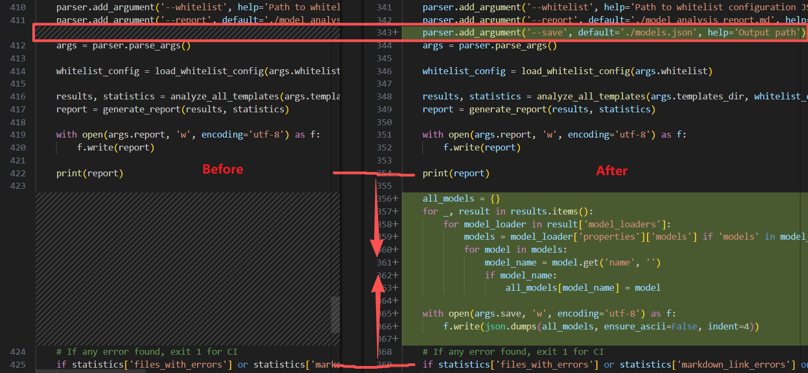

## Requirements
- install Ubuntu & Git & Docker
- install UV tool for Python
- install NVIDIA Container Toolkit
- **network proxy configuration**

## Initialize the project
clone this repository to local, and rebuild the python virtual environment.
```bash
git clone https://github.com/seanwen86/comfyui-docker.git
cd comfyui-docker
uv sync
source .venv/bin/activate
```

## Build Docker Image
1. clone this repository, and rebuild python virtual environment.
```bash
git clone https://github.com/seanwen86/comfyui-docker.git
cd comfyui-docker
uv sync
source .venv/bin/activate
```
2. download plugins
```bash
uv run plugins/clone_or_update_plugins.py
```
3. build docker image, comfyui with tag `comfyui:devel` and `comfyui:release`
```bash
docker build --target devel -t seanwen86/comfyui:devel . --load 
docker build --target release -t seanwen86/comfyui:release . --load
```
4. download models, **kinda huge**
```bash
uv run models/download_models.py
```
5. run ComfyUI container
```bash
docker run --rm -d --gpus all -p 8188:8188 -v $(pwd)/models/models:/workspace/ComfyUI/models seanwen86/comfyui:devel
```
6. visit comfyui via web browser, `127.0.0.1:8188`


## Update ComfyUI Docker (Development)

### Step 1: clone comfyui-docker
1. clone this repository to local, and rebuild the python virtual environment.
```bash
git clone https://github.com/seanwen86/comfyui-docker.git
cd comfyui-docker
uv sync
source .venv/bin/activate
```
### Step 2: update to latest comfyui (ie. `ComfyUI-0.15.1.tar.gz`)
1. download latest release `ComfyUI-0.15.1.tar.gz` source code(tar.gz) of ComfyUI from website `https://github.com/Comfy-Org/ComfyUI/releases`, put it into folder `ComfyUI` . or using cmd like below to download, take `ComfyUI-0.15.1` for example.
```bash
curl -Lo ComfyUI/ComfyUI-0.15.1.tar.gz https://github.com/Comfy-Org/ComfyUI/archive/refs/tags/v0.15.1.tar.gz
```
2. uncompress `ComfyUI-0.15.1.tar.gz`，`comfyui-workflow-templates==0.8.31` can be found in `requirements.txt`. 
```bash
tar -xzvf ComfyUI/ComfyUI-0.15.1.tar.gz -C ComfyUI/
cat ComfyUI/ComfyUI-0.15.1/requirements.txt | grep workflow-templates
```
3. download `workflow_templates-0.9.4.tar.gz` source code(tar.gz) from website `https://github.com/Comfy-Org/workflow_templates/releases`, put it into folder `models`, or using cmd like below to download. Note that the specific version `v0.9.4`.
```bash
curl -Lo ComfyUI/workflow_templates-0.9.4.tar.gz https://github.com/Comfy-Org/workflow_templates/archive/refs/tags/v0.9.4.tar.gz
```
4. uncompress `workflow_templates-0.9.4.tar.gz` to folder `models/workflow_templates-0.9.4`.
```bash
tar -xzvf ComfyUI/workflow_templates-0.9.4.tar.gz -C ComfyUI/
```
### update dependent models

1. edit `ComfyUI/workflow_templates-0.9.4/scripts/analyze_models.py`, and make following two changes.



```python
# python code for the first change
parser.add_argument('--save', default='./models.json', help='Output path')
```
```python
# python code for the second change
    preset_directories = ['checkpoints','diffusion_models','text_encoders', 'clip_vision', 
        'loras', 'vae', 'controlnet','model_patches', 'audio_encoders', 
        'upscale_models','style_models', 'latent_upscale_models']
    all_models = []
    visited = []
    for _, result in results.items():
        for model_loader in result['model_loaders']:
            models = model_loader['properties']['models'] if 'models' in model_loader['properties'] else []
            for model in models:
                name = model['name']
                if not name in visited: 
                    visited.append(name)
                    all_models.append(model)

    for _, result in results.items():
        for link in result['markdown_links']:
            item = {}
            name = link['text']
            item['name'] = name
            item['url'] = link['url']
            directory = link['url'].split('/')[-2]
            if directory in preset_directories:
                item['directory'] = directory
            else:
                item['directory'] = 'unknown'

            if not item['name'] in visited:
                visited.append(name)
                all_models.append(item)

    with open(args.save, 'w', encoding='utf-8') as f:
        f.write(json.dumps(all_models, ensure_ascii=False, indent=4))
```

2. enter folder `ComfyUI/workflow_templates-0.9.4` in which `models.json` is generated. All models are compatible with ComfyUI release, eg. `ComfyUI-0.15.1`. DO CHECK if all succeeded!!! 
```bash
cd ComfyUI/workflow_templates-0.9.4
python scripts/analyze_models.py
```

3. return to root folder of this project, move generated `models.json` and replace old `models/models.json`.
```bash
cd -
cp models/models.json models/models_bak.json
cp -f ComfyUI/workflow_templates-0.9.4/models.json models/models.json
cp -f ComfyUI/workflow_templates-0.9.4/scripts/analyze_models.py models/analyze_models.py
```

4. download the collected models in `models.json`, NOTE: models are huge.
```bash
uv run models/download_models.py
```

### update dependent plugins
1. find new dependent plugins
```bash
cd ComfyUI/workflow_templates-0.9.4
python scripts/check_links.py extract
cat links_to_check.txt | grep github.com
```
From the output, filter out all the dependent plugins as follows. NOTE: delete links that are not plugins, sometimes, links need to be corrected.
if new plugins are founded, add them into `plugins/plugins.json` and blank `commit` for new plugins.
```
https://github.com/AIWarper/ComfyUI-NormalCrafterWrapper
https://github.com/Fannovel16/ComfyUI-Frame-Interpolation
https://github.com/Fannovel16/comfyui_controlnet_aux
https://github.com/Kosinkadink/ComfyUI-VideoHelperSuite
https://github.com/Lightricks/ComfyUI-LTXVideo
https://github.com/cubiq/ComfyUI_essentials
https://github.com/filliptm/ComfyUI_Fill-Nodes
https://github.com/kijai/ComfyUI-DepthAnythingV2
https://github.com/kijai/ComfyUI-KJNodes
https://github.com/kijai/ComfyUI-segment-anything-2
https://github.com/lum3on/ComfyUI_AudioTools
```
2. download or update plugins
```bash
uv run plugins/clone_or_update_plugins.py --type CLONE
```
or **OPTIONAL**, update plugins to latest.
```bash
uv run plugins/clone_or_update_plugins.py --type UPDATE
```

3. if download or update successfully, replace original `plugins.json`
```bash
mv plugins/plugins.json plugins/plugins_bak.json
mv -f plugins/updated_plugins.json plugins/plugins.json
```

4. update `plugins/requirements.txt`
```bash
mv plugins/requirements.txt plugins/requirements_bak.txt
uv run plugins/requirements_plugins.py
mv -f plugins/remapped_requirements.txt plugins/requirements.txt
```

### build and test docker image
1. edit `Dockerfile`, update `ARG COMFYUI_VERSION` to `ARG COMFYUI_VERSION=0.15.1`.
2. go to section **[Build Docker Image](#build-docker-image)**.

### clean up
1. cleaning if all succeeded, BE CAREFUL!!!.
```bash
rm -rf models/workflow_templates-0.9.4
rm -rf ComfyUI/ComfyUI-0.15.1
rm -f models/workflow_templates-0.9.4.tar.gz
rm -f models/models_bak.json
rm -f plugins/requirements_bak.txt
```


